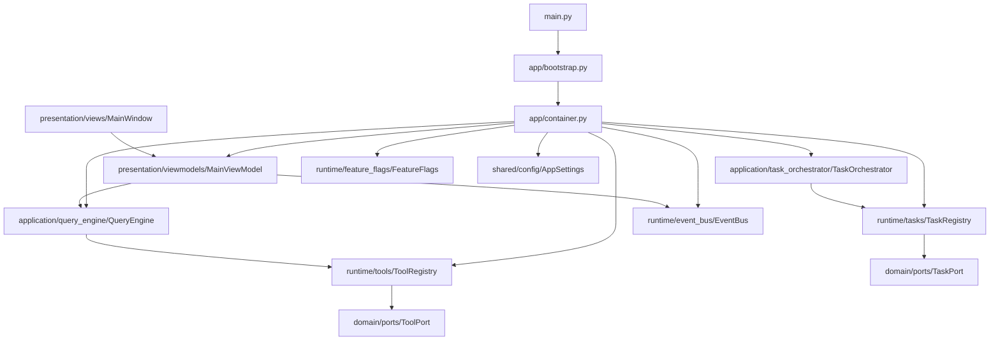

# Genie Platform Architektur (OOP, neutralisiert)

## Leitprinzipien
- Agent-Name: **Genie**
- Organisation: **BeastwareTeam**
- Strikte Layering-Regeln (kein direkter UI -> Infra Zugriff)
- Registry-Pattern für Commands/Tools/Tasks

## Mermaid

## Layer-Vertrag
1. `presentation` kennt nur `application` und `runtime/event_bus`
2. `application` kennt `domain` Ports + `runtime` Registries
3. `infrastructure` implementiert `domain` Ports
4. `shared` ist nur Utility/Config, ohne Business-Logik
