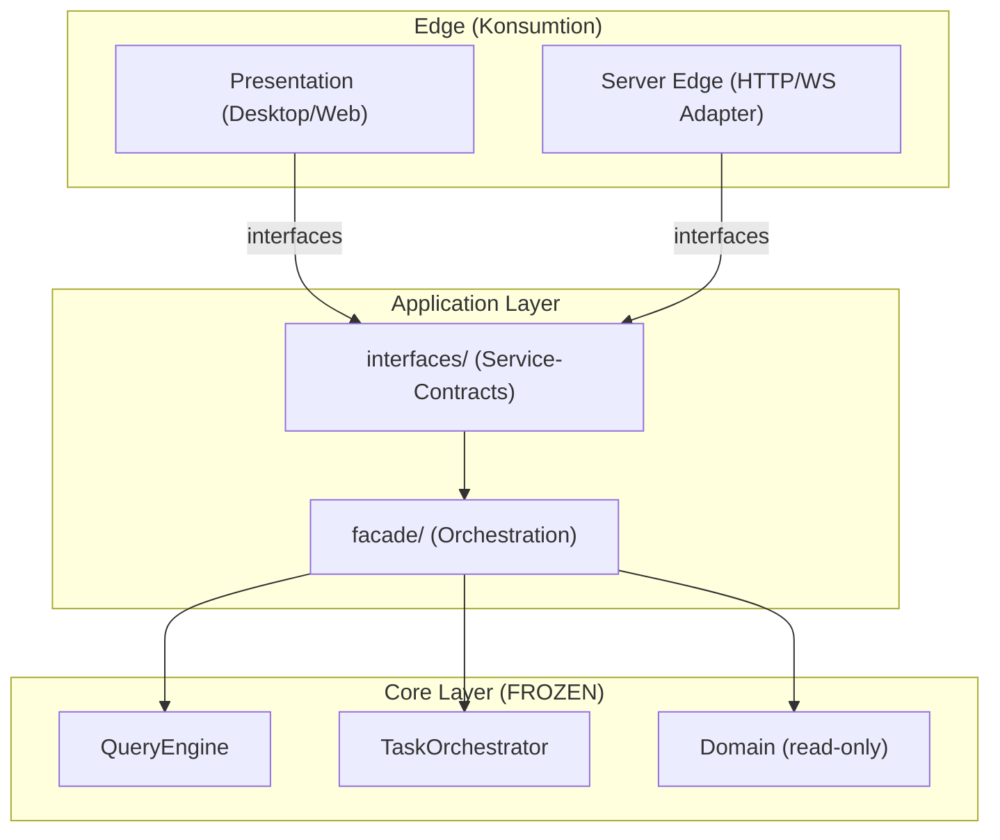

# Interface-First Architecture Implementierung

**Datum:** 3. April 2026

## Änderungen an Architektur-Dokumentation

### Kern-Updates
1. **STRUCTURE_BLUEPRINT.md** — Neue Interface-First Struktur
   - `application/interfaces/` — Service-Contracts (ChatService, TaskService, SessionService)
   - `application/facade/` — Orchestration-Fassade implementiert Interfaces
   - `infrastructure/server/` — Server-Edge als alternativer Adapter
   - Domain bleibt READ-ONLY/Frozen während Aufbau

2. **ARCHITECTURE.md** — Layer-Vertrag aktualisiert
   - Schnitt 1: Presentation/Edge ↔ Application-Interfaces
   - Schnitt 2: Orchestration ↔ Domain (frozen)

3. **TARGET_ARCHITECTURE.md** — Interface-First Regeln ergänzt
   - Neue Architektur-Regel: Interface-First für alle Konsumenten
   - Domain-Freeze-Regel: keine neuen Domain-Features während Aufbau

4. **MIGRATION_PHASES.md** — Neue Phase 0 definiert
   - 8 konkrete Schritte zum Interface-Aufbau
   - Reihenfolge: Freeze-Rule → Interfaces → Facade → ViewModel → Container → Server → QA Gates → Review

## Nächste Schritte

**Phase 0 (nächste 2 Sprints):**
1. Freeze-Regel aktivieren
2. `application/interfaces/` mit Protocols aufbauen
3. `application/facade/` mit Orchestration implementieren
4. Presentation auf Interface-Konsum umstellen
5. Container DI-Profile trennen
6. Server-Edge als Stubs vorbereiten
7. Quality Gates aktivieren
8. Architektur-Review

**Erfolgskriterium:** Interface-Contract stabil und grün über 2 aufeinanderfolgende Sprints.

## Architektur-Diagramm

## Freeze-Regel

**Betroffen:** `domain/` Komponenten bleibt während Phase 0 frozen.

**Erlaubt:**
- Lesender Zugriff auf Domain-Entities
- Nutzung bestehender Domain-Policies
- Bug-Fixes (falls kritisch)

**Nicht erlaubt:**
- Neue Domain-Features
- Domain-Model Refactors
- Neue Policies
- Vertrags-Änderungen

**Dauer:** bis Interface-Contract 2 aufeinanderfolgende Sprints grün läuft.
