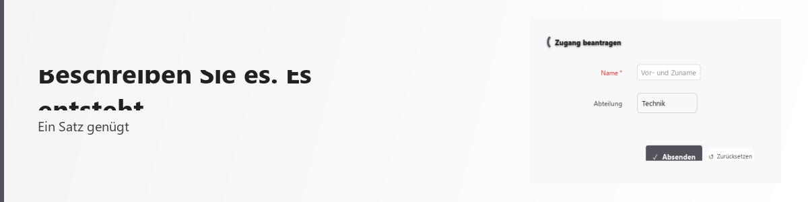
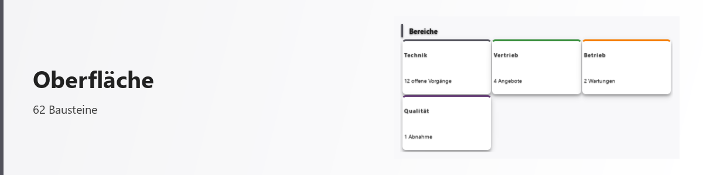
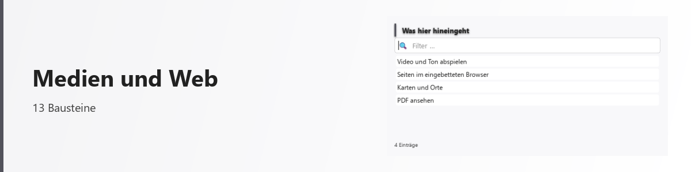
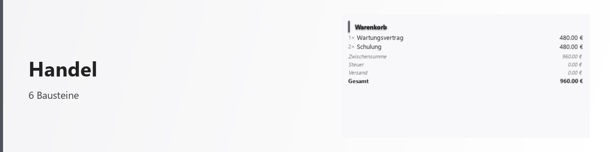

<picture>
  <source media="(prefers-color-scheme: dark)" srcset="public/bilder/kopf/start.png">
  
</picture>

# Genie Platform

**Beschreiben Sie, was Sie brauchen — die Plattform baut daraus eine bedienbare Fläche.**

Ein Satz genügt: *„eine Tabelle mit meinen offenen Rechnungen"*, *„ein Balkendiagramm der
Ausgaben je Monat"*. Daraus entsteht kein Vorschlag und kein leeres Formular, sondern ein
fertiger Baustein, der sofort bedienbar ist — sortierbar, durchsuchbar, ausgebbar, ohne dass
davon etwas eigens angefordert werden musste.

Das Wichtigste läuft dabei auf dem eigenen Rechner: Sprachmodelle, Sprachausgabe,
Texterkennung, Datenbank. Dienste im Netz sind eine Wahl, kein Zwang.

📖 **[Die vollständige Beschreibung](https://beastwareteam.github.io/genie-platform/)** —
was die Plattform kann, wie sie bedient wird, worauf sie steht. Dieselben Seiten liegen
auch hier im Verzeichnis unter [`public/`](public/de/index.md).

## Ansehen

<!-- kacheln: anfang -->
<table>
<tr>
<td width="50%"><a href="public/de/landkarte.md"><picture><source media="(prefers-color-scheme: dark)" srcset="public/bilder/kopf/landkarte.png"></picture></a><br><b><a href="public/de/landkarte.md">Landkarte der Bausteine</a></b><br>Was es gibt und wo es hingehört — 146 Bausteine in 23 Familien.</td>
<td width="50%"><a href="public/de/typen/index.md"><picture><source media="(prefers-color-scheme: dark)" srcset="public/bilder/kopf/bausteine.png"></picture></a><br><b><a href="public/de/typen/index.md">Baustein-Verzeichnis</a></b><br>Jeder Baustein einzeln beschrieben — was er ist, wann man ihn nimmt.</td>
</tr>
<tr>
<td width="50%"><a href="public/de/oberflaeche.md"><picture><source media="(prefers-color-scheme: dark)" srcset="public/bilder/kopf/oberflaeche.png"></picture></a><br><b><a href="public/de/oberflaeche.md">Oberfläche</a></b><br>Eingeben, auswählen, anzeigen, ordnen — 62 Bausteine für die Fläche.</td>
<td width="50%"><a href="public/de/daten.md"><picture><source media="(prefers-color-scheme: dark)" srcset="public/bilder/kopf/daten.png"></picture></a><br><b><a href="public/de/daten.md">Daten</a></b><br>Bestände bedienbar machen, als Bild verstehen, aus ihnen rechnen.</td>
</tr>
<tr>
<td width="50%"><a href="public/de/medien_und_web.md"><picture><source media="(prefers-color-scheme: dark)" srcset="public/bilder/kopf/medien_und_web.png"></picture></a><br><b><a href="public/de/medien_und_web.md">Medien und Web</a></b><br>Video und Ton, der eingebettete Browser, Karten, PDF.</td>
<td width="50%"><a href="public/de/handel.md"><picture><source media="(prefers-color-scheme: dark)" srcset="public/bilder/kopf/handel.png"></picture></a><br><b><a href="public/de/handel.md">Handel</a></b><br>Preis, Produkt, Warenkorb, Bewertung — wenn Handelsangaben ins Bild gehören.</td>
</tr>
</table>
<!-- kacheln: ende -->

Dazu: [Videos](public/de/videos.md) — jeweils auch vollständig als Text ·
[Was neu ist](public/news/index.md) — Neuerungen, die im Alltag einen Unterschied machen.

## Loslegen

> **Der Quelltext in diesem Verzeichnis ist nicht auf dem Stand dieser Seiten.**
> Sie beschreiben die Plattform, wie sie gerade entwickelt wird; der Quelltext wird davon
> getrennt veröffentlicht und hinkt hinterher.

```bash
pip install -e .
python -m genie.main
```

Danach genügt ein Satz im Chat-Fenster. `/status` sagt, woran es hängt, `/wiki` erklärt die
Bedienung.

## Für Entwickler

Einrichtung, Server-Betrieb, Architektur-Prüfung und Verzeichnisaufbau stehen in
[docs/ENTWICKLERSTART.md](docs/ENTWICKLERSTART.md).

---

[KI-Transparenz](public/de/ki_transparenz.md) ·
[Barrierefreiheit](public/de/barrierefreiheit.md) ·
[Lizenzen und Herkunft](public/de/lizenzen.md)

> **Für das Gesamtwerk ist noch keine Lizenz gesetzt.** Bis dahin gilt das Urheberrecht in
> seiner Grundform: alle Rechte vorbehalten.
