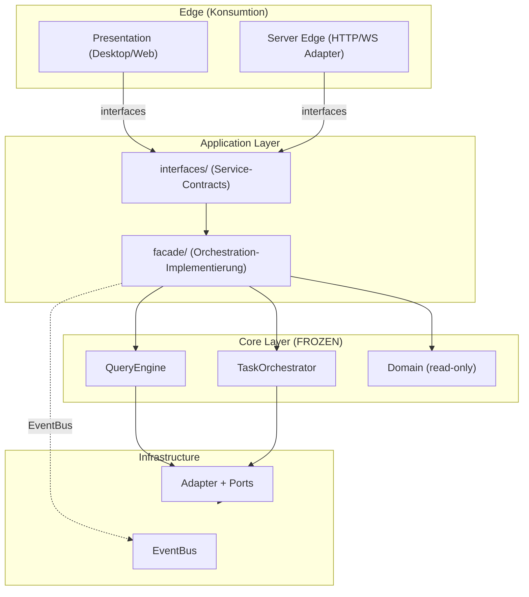

# Struktur-Blueprint: Interface-First Architektur

Architektur für die Genie-Plattform mit expliziter Trennung von Application-Interfaces, Service-Fassaden und Domain-Core.
Das Interface-System ermöglicht Konsumption durch Presentation (Desktop/Web) und Edge-Systeme ohne direkte Abhängigkeiten.

## Soll-Dateibaum

```text
src/genie/
  app/
    bootstrap.py
    container.py        → Core-Wiring + Edge-Wiring (getrennt)
    lifecycle.py
  presentation/
    views/
    viewmodels/         → nutzt nur application/interfaces, nie QueryEngine/TaskOrchestrator direkt
    widgets/
  application/
    interfaces/         ← NEU: Service-Contracts (ChatService, TaskService, SessionService)
    facade/             ← NEU: Orchestration-Fassade (implementiert interfaces)
    query_engine/
    task_orchestrator/
    use_cases/
    commands/
  domain/
    entities/           → FREEZE: nur lesender Zugriff gestattet
    value_objects/
    services/
    ports/
    policies/
  infrastructure/
    api_clients/
    mcp/
    persistence/
    plugins/
    telemetry/
    server/             → Server-Edge: Adapter-Stubs gegen Facade-Interfaces
  runtime/
    tools/
    tasks/
    hooks/
    event_bus/
    feature_flags/
  shared/
    config/
    logging/
    errors/
    typing/
```

## Architektur-Schnitte (Interface-First)

### Schnitt 1: Presentation/Edge ↔ Application-Interfaces
- **Außen (Konsument):** Presentation (viewmodels), Server-Edge, externe APIs
- **Innen (Provider):** `application/interfaces/*` (reine Protocol-Definitionen)
- **Typen über der Grenze:** nur Service-Interfaces und ihre Input/Output Contracts
- **Verboten:** Imports von QueryEngine, TaskOrchestrator, Direct Domain Access

### Schnitt 2: Application-Orchestration ↔ Domain
- **Außen (Konsument):** Facade, QueryEngine, TaskOrchestrator (lesend)
- **Innen (Provider):** Domain (FREEZE-Phase: Entities, Services, Policies sind read-only)
- **Typen über der Grenze:** Domain Entities (via Ports), Value Objects
- **Verboten:** neue Domain Features, Domain-Refactors, neue Domain-Policies

## Domain & Core Freeze

**Frozen-Komponenten (bis Interface-Contract grün läuft, ~2 Sprints):**
- Domain-Logik (Entities, Services, Policies)
- Domain-Ports (reine Schnittstellen zu Adaptern)
- Bestehende Domain-Policies und Entitäten-Verträge

**Erlaubte Operationen:**
- Lesender Zugriff auf Domain-Entities und Domain-Services
- Nutzung bestehender Domain-Policies ohne Ergänzung
- Bug-Fixes in Domain-Code (falls kritisch)

**Verbotene Operationen:**
- Neue Domain-Features oder Use-Cases
- Domain-Model Refactors
- Neue Policies oder Business-Rules
- Änderungen an bestehenden Domain-Verträgen

## Schicht-Definitionen

| Schicht | Verantwortung | Abhängigkeiten |
|---------|--------------|----------------|
| `application/interfaces/` | Protocol-Definitionen (ChatService, TaskService, SessionService) | keine |
| `application/facade/` | Service-Implementierung, Orchestration-Leitung | interfaces, QueryEngine, TaskOrchestrator, EventBus, Domain (read) |
| `presentation/viewmodels/` | UI-State-Management, Command-Dispatch | application/interfaces, shared |
| `app/container.py` | Dependency Injection für Core + Edge (DI-Profile getrennt) | alle |
| `infrastructure/server/` | Server-Edge: HTTP/WebSocket Adapter gegen Facade-Interfaces | application/interfaces, facade |
| `domain/` | Business-Logik (READ-ONLY während Freeze) | keine Abhängigkeiten nach außen |

## Minimale Qualitätskriterien

- ✅ Interface-Contract-Tests für jedes Service-Interface in `application/interfaces/`
- ✅ Keine direkten Imports von QueryEngine/TaskOrchestrator außerhalb der Facade
- ✅ Edge (Desktop/Server) importiert nur aus `application/interfaces` und `shared`
- ✅ Domain-Zugriff nur lesend (via Ports), keine neue Logik
- ✅ Linter-Regel: `application/viewmodels` → nur `application/interfaces` erlaubt
- ✅ Freeze-Regel in Commit-Checklist: keine Domain-Änderungen außer Bug-Fixes

## Reihenfolge für Interface-Aufbau

1. **Freeze-Regel in Commit-Checklist** — Domain-Änderungen manuell validieren
2. **Interfaces definieren** — `ChatService`, `TaskService`, `SessionService` als reine Protocols
3. **Facade aufbauen** — Implementierung in `application/facade/` mit Orchestration
4. **ViewModel entkoppeln** — viewmodels → nur Facade-Interfaces, nie direkt QueryEngine
5. **Container-Wiring trennen** — separate DI-Profile für Core und Edge
6. **Server-Edge vorbereiten** — HTTP-Adapter gegen Facade-Interfaces
7. **Quality Gates aktivieren** — Linter + Contract-Tests enforcement
8. **Review** — Architektur-Review mit Stakeholdern

## Modul-Kontrakte (angepasst)

- **interfaces/\*:** reine Protocol-Definitionen, keine Implementierung, input/output Contracts dokumentiert
- **facade/\*:** Implementierung der Service-Interfaces, zentrale Orchestration, kapselt QueryEngine + TaskOrchestrator + EventBus
- **viewmodels/\*:** konsumiert nur Interfaces, bindet Commands, UI-State-Management
- **query_engine:** turn-basierte Konversation (von Facade aus delegiert, nicht direkt von UI)
- **task_orchestrator:** Task-Lifecycle (von Facade aus delegiert)
- **domain/:** Business-Logik (FREEZE während Interface-Aufbau), read-only Zugriff via Ports
- **infrastructure/\*:** Adapter für Ports, Server als zusätzlicher Adapter gegen Facade-Interfaces

## Architektur-Diagramm


