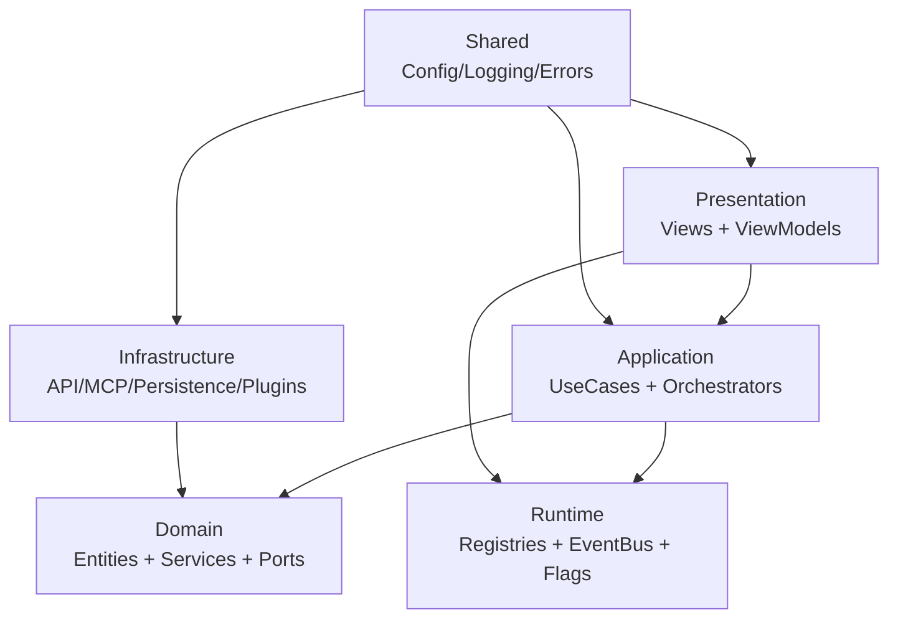

# Zielarchitektur (Sollbild) – Genie Platform

Stand: 2026-04-03

## 1) Architekturziel
Eine vollständig objektorientierte Desktop-Architektur mit PySide6, bei der Fachlogik strikt von UI und Infrastruktur getrennt bleibt.

## 2) Verbindliche Schichten
1. Presentation
   - Verantwortet Anzeige, Eingabe, ViewModel-Bindung.
   - Darf keine Infrastruktur direkt aufrufen.
2. Application
   - Orchestriert Use-Cases, Query-Flows, Task-Flows.
   - Spricht nur über Domain-Ports mit Infrastruktur.
3. Domain
   - Enthält fachliche Modelle, Policies, Value Objects.
   - Keine Abhängigkeit auf PySide6 oder konkrete I/O-Adapter.
4. Infrastructure
   - Implementiert Ports für API/MCP/Persistenz/Plugins.
5. Runtime
   - Tool-/Task-Registries, EventBus, FeatureFlags, Hook-Pipeline.
6. Shared
   - Cross-cutting Utilities (Config, Logging, Errors, Typing).

## 3) Architekturregeln
- Dependency Rule: Außen darf nach innen zeigen, innen nie nach außen.
- Ports-and-Adapters: Infrastruktur nur über Interfaces/Protocols.
- Use-Case First: neue Features beginnen in Application Use-Cases.
- Framework Isolation: Domain bleibt vollständig framework-unabhängig.
- **Interface-First (NEU):** Alle Konsumenten (Presentation/Server-Edge) nutzen nur `application/interfaces`
- **Domain-Freeze (NEU):** Domain-Logik ist während Interface-Aufbau frozen (read-only, kein Ausbau)

## 4) Kern-Module (Ziel)
- app: Bootstrap, Container, Lifecycle
- presentation: views, viewmodels, widgets
- application: use_cases, query_engine, task_orchestrator, commands
- domain: entities, value_objects, services, ports, policies
- infrastructure: api_clients, mcp, persistence, plugins, telemetry
- runtime: tools, tasks, hooks, event_bus, feature_flags

## 5) Mermaid (Soll-Topologie)

## 6) Nicht-Ziele (vorerst)
- Kein verteiltes Microservice-Modell.
- Kein Plugin-Marketplace-Backend in Phase 1.
- Keine vorgezogene PR-Automation als primärer Fokus.
