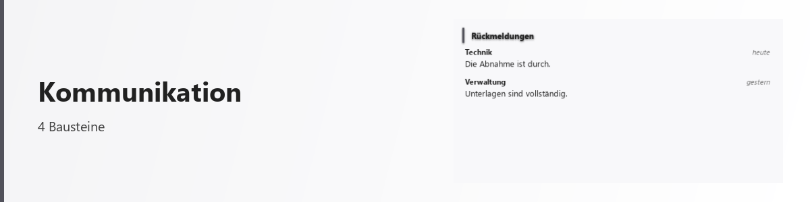

# Kommunikation

<picture>
  <source media="(prefers-color-scheme: dark)" srcset="../bilder/kopf/kommunikation.png">
  
</picture>

Die Plattform kann E-Mail-Postfächer, Kontakte und Beiträge aus sozialen Netzen in dieselbe
Oberfläche holen, in der auch alles andere entsteht. Ein Satz genügt, um sich eine
Kommunikations-Fläche bauen zu lassen — sie ist danach ein Bestandteil wie jeder andere und
lässt sich umstellen, erweitern und neben andere Flächen legen.

## E-Mail

Die E-Mail-Fläche spricht direkt mit Ihrem Postfach über die üblichen offenen Verfahren. Sie
brauchen kein zusätzliches Konto bei uns; die Zugangsdaten bleiben auf Ihrem Rechner.

**Was Sie damit tun können**

- Postfächer mehrerer Anbieter nebeneinander führen und zwischen ihnen wechseln
- Ordner Ihres Postfachs durchsehen — die Ordnerstruktur wird so übernommen, wie sie beim
  Anbieter angelegt ist
- Nachrichten lesen, verfassen, beantworten, verschieben, löschen und archivieren
- mehrere Nachrichten auf einmal auswählen und in einem Zug verschieben oder löschen
- Nachrichten per Ziehen in einen anderen Ordner legen
- sich anmelden über ein Passwort oder über die Anmeldeschaltfläche des Anbieters, wo dieser
  sie anbietet

**Wie Ihre Post dargestellt wird**

Nachrichten mit aufwendiger Gestaltung werden vor der Anzeige entschärft: Skripte und
eingebettete aktive Bestandteile werden entfernt, und Bilder von fremden Servern bleiben
zunächst gesperrt. Sie sehen an der Stelle einen sichtbaren Platzhalter statt eines Lochs im
Text und entscheiden selbst, ob die Bilder geladen werden sollen. Der Grund ist einfach: ein
nachgeladenes Bild verrät dem Absender, dass und wann Sie seine Nachricht geöffnet haben.

Der Lesebereich stellt Nachrichten auf einer hellen Fläche dar, auch wenn die übrige Oberfläche
dunkel eingestellt ist. Das entspricht dem, was andere E-Mail-Programme tun, und hat einen
praktischen Grund: die meisten Nachrichten sind für hellen Grund gestaltet.

**Anhänge** werden vor dem Öffnen eingestuft. Was gefährlich sein kann, landet erst in einem
Wartebereich und wird nicht beiläufig geöffnet.

## Kontakte

Eine eigene Kontaktverwaltung, die auf Ihrem Rechner bleibt. Sie können Einträge anlegen,
bearbeiten und löschen — und Absender aus Ihrem Posteingang übernehmen, ohne sie einzeln
abzutippen. Doppelte Einträge werden dabei zusammengeführt.

## Soziale Netze

Eine Fläche für Profil, Verlauf, Reaktionen und Kommentare. Sie ist als Baukasten angelegt:
Avatar, Beitragsverlauf, Reaktionsleiste und Kommentarstrang sind einzelne Bausteine, die sich
auch getrennt verwenden lassen — etwa ein Kommentarstrang unter etwas ganz anderem.

## Alles zusammen auf einer Fläche

E-Mail und soziale Netze lassen sich zu einer gemeinsamen Kommunikations-Zentrale
zusammenstellen, in der beides nebeneinander liegt. Das ist kein Sonderfall, sondern dieselbe
Zusammenstell-Technik, mit der sich jede Fläche aus mehreren Bausteinen aufbauen lässt.

## Was hier ehrlicherweise noch fehlt

- Der Beitragsverlauf sozialer Netze arbeitet noch nicht mit den Anmeldeverfahren der großen
  Anbieter zusammen — die Fläche steht, die Anbindung an einzelne Netze nicht.
- Kalender und Adressbücher großer Anbieter sind noch nicht angebunden.
- Sehr große Postfächer werden vollständig geladen statt seitenweise; bei vielen tausend
  Nachrichten in einem Ordner macht sich das bemerkbar.

---

Sie finden die einzelnen Bausteine dieses Bereichs im
[Baustein-Verzeichnis](typen/index.md) unter *social* und in der Übersicht der Familien.
