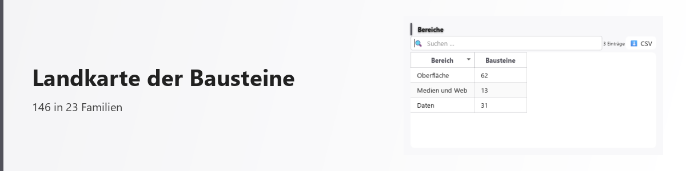

# Landkarte der Bausteine

<picture>
  <source media="(prefers-color-scheme: dark)" srcset="../bilder/kopf/landkarte.png">
  
</picture>

Die Plattform bringt **146 Bausteine** in **23 Familien** mit. <!-- fakt: bausteine, familien -->
Diese Seite zeigt, wo sie hingehören — und welche noch keine Erklärung haben.

```mermaid
graph TD
    W[Was Sie beschreiben]
    W --> OBE["Oberfläche<br/>62 Bausteine"]
    OBE --> OBE_input["input · 8"]
    OBE --> OBE_interaction["interaction · 5"]
    OBE --> OBE_display["display · 7"]
    OBE --> OBE_content["content · 8"]
    OBE --> OBE_container["container · 6"]
    OBE --> OBE_feedback["feedback · 9"]
    OBE --> OBE_navigation["navigation · 6"]
    OBE --> OBE_datetime["datetime · 4"]
    OBE --> OBE_status["status · 3"]
    OBE --> OBE_overlay["overlay · 3"]
    OBE --> OBE_layout["layout · 3"]
    W --> DAT["Daten<br/>31 Bausteine"]
    DAT --> DAT_data["data · 10"]
    DAT --> DAT_dataviz["dataviz · 15"]
    DAT --> DAT_compute["compute · 2"]
    DAT --> DAT_enterprise["enterprise · 1"]
    DAT --> DAT_diagram["diagram · 3"]
    W --> MED["Medien und Web<br/>13 Bausteine"]
    MED --> MED_media["media · 7"]
    MED --> MED_web["web · 6"]
    W --> HAN["Handel<br/>6 Bausteine"]
    HAN --> HAN_commerce["commerce · 6"]
    W --> KOM["Kommunikation<br/>4 Bausteine"]
    KOM --> KOM_social["social · 4"]
    W -.-> LUECKE["noch ohne Erklärseite<br/>30 Bausteine"]
    LUECKE -.-> L_system["system · 23"]
    LUECKE -.-> L_config["config · 5"]
    LUECKE -.-> L_advanced["advanced · 2"]
```

<!-- erzeugt: landkarte — nicht von Hand aendern -->

| Bereich | Bausteine | Familien |
| --- | ---: | --- |
| [Oberfläche](oberflaeche.md) | 62 | input (8), interaction (5), display (7), content (8), container (6), feedback (9), navigation (6), datetime (4), status (3), overlay (3), layout (3) |
| [Daten](daten.md) | 31 | data (10), dataviz (15), compute (2), enterprise (1), diagram (3) |
| [Medien und Web](medien_und_web.md) | 13 | media (7), web (6) |
| [Handel](handel.md) | 6 | commerce (6) |
| [Kommunikation](kommunikation.md) | 4 | social (4) |
| *noch ohne Erklärseite* | 30 | system (23), config (5), advanced (2) |
| **Gesamt** | **146** | **23 Familien** |
<!-- ende: landkarte -->

## Was hier ehrlicherweise offen ist

30 der 146 Bausteine haben **keine Erklärseite**:

- **system** (23) — Zustand des Rechners und der Plattform beobachten und steuern
- **config** (5) — Einstellungen und Profile der Plattform selbst bearbeiten
- **advanced** (2) — die letzte Wahl, wenn kein deklarativer Baustein passt

Sie sind im [Baustein-Verzeichnis](typen/index.md) vollständig beschrieben — was fehlt, ist
die Einordnung in Alltagssprache, wie sie die anderen Bereiche haben. Das ist eine Lücke,
keine Absicht.

---

Diese Seite wird aus dem Bausteinverzeichnis der Plattform **erzeugt**
(`scripts/medien_diagramme.py`). Die Zahlen können deshalb nicht veralten, ohne dass es
auffällt.
