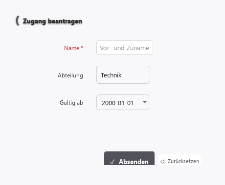
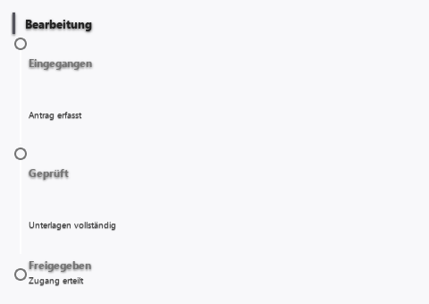
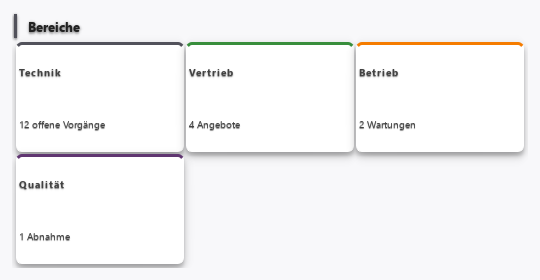
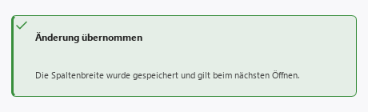

# Oberfläche

<picture>
  <source media="(prefers-color-scheme: dark)" srcset="../bilder/kopf/oberflaeche.png">
  
</picture>

Mit **62 Bausteinen** ist dies der größte Bereich der Plattform — alles, womit ein Mensch
unmittelbar umgeht: Eingeben, Auswählen, Auslösen, Anzeigen, Blättern, Zurückmelden.

Sie müssen keinen davon auswendig kennen. Sie beschreiben, was Sie brauchen, und die
Konstruktion wählt aus. Diese Seite erklärt, **wonach** sie wählt — damit Sie beeinflussen
können, was entsteht.

<picture>
  <source media="(prefers-color-scheme: dark)" srcset="../bilder/bausteine/formular.png">
  
</picture>

*Ein Formular, wie es aus einer Beschreibung entsteht. Das Bild ist kein Entwurf: es wird
bei jeder Änderung neu aus einem echten Bau aufgenommen.*

## Die sechs Fragen, nach denen sortiert wird

| Wenn Sie… | dann greift |
| --- | --- |
| etwas eingeben oder auswählen wollen, das danach weiterverwendet wird | **Eingabe** — Formular, Auswahlfeld, Schieberegler, Datei-Übernahme |
| etwas auslösen wollen — eine Aktion, keine Eingabe | **Interaktion** — Schaltflächen, Schalter, Befehlsleisten |
| etwas nur zeigen wollen, ohne dass es geändert wird | **Anzeige** — Text, Wert, Liste, Tabelle, Abzeichen |
| Text als Inhalt setzen — Überschrift, Absatz, Quelltext | **Inhalt** |
| viel Inhalt abschnittsweise zeigen — eingeklappt, gestuft, geblättert | **Behälter** |
| jemandem etwas mitteilen, das er zur Kenntnis nimmt statt bedient | **Rückmeldung** — Hinweis, Fortschritt, Meldung |

Dazu kommen **Navigation** (zwischen Orten wechseln, ohne Daten zu ändern), **Zeitangaben**
(Zeitpunkt oder Zeitraum wählen), **Zustand** (Ampeln, Abzeichen), **Überlagerung** (Dialoge,
Einblendungen) und **Aufteilung** (wie der Platz auf der Fläche verteilt wird).

<picture>
  <source media="(prefers-color-scheme: dark)" srcset="../bilder/bausteine/verlauf.png">
  
</picture>

*Ein Zustand über die Zeit — dieselbe Sache, die als Tabelle nur eine Spalte „Stand“ wäre.*

## Warum die Unterscheidung zählt

Zwischen „ein Wert wird gezeigt" und „ein Wert wird eingegeben" liegt der ganze Unterschied
zwischen einer Anzeige und einem Formular. Beschreiben Sie also nicht nur **was**, sondern
**was damit geschehen soll** — daraus entsteht die Wahl.

Zwei Beispiele:

- *„Zeig mir die Auslastung"* führt zu einer Anzeige.
- *„Lass mich die Auslastungsgrenze einstellen"* führt zu einer Eingabe mit Wertebereich.

## Die Bausteine miteinander verbinden

Bausteine stehen nicht nebeneinander, sie können ineinandergreifen: Was der eine ausgibt, kann
der andere entgegennehmen — eine Auswahl in einer Liste füllt eine Anzeige daneben, eine
übernommene Datei füllt eine Tabelle. Im [Baustein-Verzeichnis](typen/index.md) steht bei
jedem Baustein, was er entgegennimmt und was er weitergibt.

<picture>
  <source media="(prefers-color-scheme: dark)" srcset="../bilder/bausteine/kacheln.png">
  
</picture>

*Dieselben Angaben als Kacheln statt als Liste — die Wahl entsteht daraus, was Sie
beschreiben, nicht daraus, was Sie anklicken.*

## Größe und Aufteilung

Was Sie an einer Fläche ziehen, bleibt so. Spaltenbreiten, Trennerpositionen, die Reihenfolge
von Reitern — solche Handgriffe werden übernommen, sobald Sie sie machen.

Die **Größe des Fensters** verhält sich bewusst anders: sie wird nur im dafür eingeschalteten
Modus übernommen. Der Grund ist eine Alltagsbeobachtung — ein Fenster zieht man auch größer,
nur um Platz zu schaffen. Einen Spaltentrenner zieht dagegen niemand aus Versehen.

<picture>
  <source media="(prefers-color-scheme: dark)" srcset="../bilder/bausteine/hinweis.png">
  
</picture>

*Übernommen heißt: beim nächsten Öffnen ist es noch so. Sie erfahren das, ohne danach
suchen zu müssen.*

## Was hier ehrlicherweise offen ist

- Einige Bausteine sind bewusst noch Gerüste: sie lassen sich einsetzen, bringen aber noch
  keine ausgebaute Bedienung mit. Sie sind im Verzeichnis als solche gekennzeichnet.
- Die Bedienbarkeit ohne Maus und mit Hilfsmitteln ist über alle Bausteine hinweg **nicht**
  durchgeprüft — siehe [Barrierefreiheit](barrierefreiheit.md).

---

Alle 62 Bausteine mit Beschreibung stehen im [Baustein-Verzeichnis](typen/index.md).
