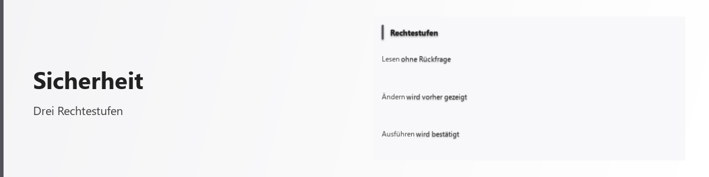

# Sicherheit

<picture>
  <source media="(prefers-color-scheme: dark)" srcset="../bilder/kopf/sicherheit.png">
  
</picture>

Eine Plattform, die auf Zuruf Bedienflächen baut und dabei auch Anweisungen ausführen kann,
muss erklären, was sie tut und was sie nicht tut. Diese Seite tut das — einschließlich der
Stellen, an denen etwas offen ist.

## Der Grundsatz: so wenig Rechte wie nötig

Jede Fähigkeit, die eine gebaute Fläche ausführen will, geht vorher durch eine Prüfung. Sie
fragt nicht bei jedem Klick nach, sondern entscheidet nach festen Regeln — und zwar nach drei Rechtestufen: <!-- fakt: rechtestufen -->

| Stufe | Was darunter fällt | Was geschieht |
| --- | --- | --- |
| Ungefährlich | Umrechnen, Auswerten, Umformen | immer erlaubt, in einer abgeschirmten Umgebung |
| Bewacht | Dateien lesen und schreiben, Abläufe, Agenten | örtlich erlaubt, aber protokolliert |
| Kritisch | Systemverzeichnisse, das Programmverzeichnis selbst, ganze Partitionen | gesperrt, solange Sie es nicht ausdrücklich öffnen |

Kritische Zugriffe sind also **nicht** eine Frage der Vorsicht, sondern von vornherein zu.
Sie öffnen sich nur, wenn Sie das für einen bestimmten Bau ausdrücklich erlauben oder einen
Pfad namentlich freigeben.

## Die Freigabe vor dem Bau

Bevor eine Fläche entsteht, die etwas ausführen kann, wird gefragt — einmal, mit Auswahl:
Sie sehen, welche Fähigkeiten sie haben soll, und können einzelne davon abwählen. Was Sie
abwählen, bleibt gesperrt, auch wenn die Fläche es später versucht.

Das ist bewusst ein Dialog vor dem Bau und nicht eine Rückfrage bei jeder Ausführung. Eine
Nachfrage, die zwanzigmal kommt, wird weggeklickt statt gelesen.

## Ausgeführte Anweisungen

Es gibt Bausteine, die hinterlegte Rechenvorschriften ausführen. Sie laufen in einer
abgeschirmten Umgebung, in der nur eine begrenzte Auswahl von Sprachmitteln zur Verfügung
steht — kein Zugriff auf das Dateisystem, kein Nachladen beliebiger Bestandteile. Im
Baustein-Verzeichnis ist jeder solche Baustein als **„Führt Code aus"** gekennzeichnet.

## Das Protokoll

Sicherheitsrelevante Vorgänge werden fortlaufend aufgezeichnet — anfügend, nicht
überschreibend. Das Protokoll hält fest, was ausgeführt wurde, woher es kam und wie
entschieden wurde. Es ist ab Werk eingeschaltet.

## Was auf Ihrem Rechner bleibt

Sprachmodelle können örtlich laufen. Zugangsdaten für Postfächer, Kontakte und Verläufe liegen
auf Ihrem Rechner. Die Plattform bringt keinen eigenen Dienst mit, bei dem Sie ein Konto
brauchen.

Wo etwas doch nach außen geht — ein Übersetzungsdienst, eine Suche, ein Bild in einer
E-Mail —, ist es benannt und in aller Regel abschaltbar.

## Was hier ehrlicherweise offen ist

- Die abgeschirmte Umgebung für ausgeführte Anweisungen gibt es in **zwei** Ausführungen mit
  unterschiedlicher Strenge. Das ist historisch gewachsen und noch nicht zusammengeführt.
- Ob die Plattform als Verbraucherprodukt unter die Barrierefreiheits-Anforderungen fällt,
  hängt davon ab, wie sie angeboten wird. Der Stand dazu steht in der
  [Barrierefreiheits-Erklärung](barrierefreiheit.md).
- Diese Seite beschreibt, wie die Absicherung angelegt ist. Sie ist **keine** Bestätigung
  durch eine unabhängige Stelle — eine solche Prüfung hat nicht stattgefunden.

---

Wenn Sie eine Schwachstelle finden, melden Sie sie bitte, bevor Sie sie veröffentlichen. Den
Weg dafür finden Sie in den Hinweisen zum Projekt.
