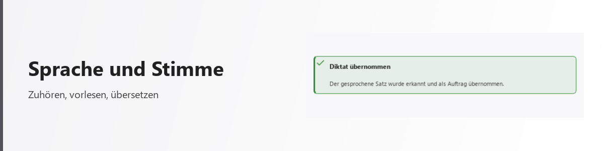

# Sprache und Stimme

<picture>
  <source media="(prefers-color-scheme: dark)" srcset="../bilder/kopf/sprache_und_stimme.png">
  
</picture>

Die Plattform kann zuhören und sprechen. Beides läuft, soweit es geht, auf Ihrem eigenen
Rechner — nicht, weil es bequemer wäre, sondern weil gesprochene Sprache zu den
persönlichsten Daten gehört, die es gibt.

## Vorlesen

Texte, Antworten und Abschnitte lassen sich vorlesen. Die Stimme ist eine neurale
Vorlese-Stimme und klingt nicht nach den bekannten Roboterstimmen des Betriebssystems.

**Was Sie einstellen können**

- die Stimme aus einem Verzeichnis verfügbarer Stimmen
- die Lautstärke, wirksam während des Sprechens statt erst beim nächsten Absatz
- Anhalten und Fortsetzen mitten im Text

Vorgelesen wird abschnittsweise. Das hat einen hörbaren Vorteil: Sie können mittendrin
abbrechen, und eine Änderung an der Lautstärke greift innerhalb weniger Sekunden statt erst
beim nächsten Text.

## Diktieren

Gesprochenes wird in Text umgesetzt, während Sie sprechen — die Wörter erscheinen im
Eingabefeld, ohne dass Sie das Ende abwarten müssen.

Dafür gibt es zwei Wege, und Sie entscheiden, welcher gilt:

| Weg | Was passiert | Wann sinnvoll |
| --- | --- | --- |
| Bordmittel des Betriebssystems | Erkennung auf Ihrem Rechner, Wort für Wort live | Regelfall — nichts verlässt den Rechner |
| Örtliches Sprachmodell | Aufnahme wird an ein auf Ihrem Rechner laufendes Modell übergeben | wenn Sie höhere Genauigkeit brauchen; Ergebnis kommt am Stück statt live |

Beide Wege arbeiten örtlich. Es gibt Betriebsarten für unterschiedliche Ansprüche an
Vertraulichkeit, und die gewählte Art bestimmt, was mit einer Aufnahme geschieht, nachdem sie
umgesetzt wurde.

## Mehrsprachigkeit

Die Oberfläche trägt ihre Texte nicht fest eingebaut, sondern in austauschbaren Sprachdateien.
Eine Sprache ist damit eine Datei, kein Umbau. Vorhanden sind zwei Sprachen: Deutsch und Englisch. <!-- fakt: sprachen -->

Übersetzen kann die Plattform außerdem zur Laufzeit: Text lässt sich in eine andere Sprache
bringen und in dieser auch vorlesen. Dafür stehen mehrere Übersetzungsdienste zur Auswahl.

## Was hier ehrlicherweise noch fehlt

- Die englische Sprachdatei ist deutlich kleiner als die deutsche. Wo ein englischer Text
  fehlt, erscheint der deutsche — nichts bleibt leer, aber die Oberfläche ist noch nicht
  durchgehend zweisprachig.
- Ein großer Teil der Oberflächentexte steht noch fest im Programm statt in den Sprachdateien.
  Diese Texte wandern nach und nach dorthin; bis dahin ändern sie sich beim Sprachwechsel
  nicht mit.
- Weitere Sprachen sind vorgesehen, aber noch nicht angelegt.

---

Wenn eine Sprachfassung dieser Seiten maschinell übersetzt wurde, steht das oben auf der
jeweiligen Seite. Eine Übersetzung, die niemand geprüft hat, soll nicht so aussehen, als
hätte sie jemand geschrieben.
