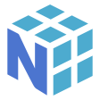

# Worauf die Plattform steht

Diese Seite beantwortet eine Frage, die man selten gestellt bekommt und immer haben will:
**womit ist das hier eigentlich gebaut?**

Zwei Dinge vorweg, weil sie den Rest lesbar machen:

- **Das Wichtigste läuft auf Ihrem Rechner.** Sprachmodelle, Sprachausgabe, Texterkennung,
  Datenbank — alles davon hat einen örtlichen Weg. Dienste im Netz sind eine Wahl, kein Zwang,
  und jeder von ihnen braucht einen Schlüssel, den Sie selbst eintragen.
- **Nicht jede Technologie hat hier ein Zeichen.** Wo es kein Herstellerlogo gibt oder wir
  keines zeigen dürfen, steht ein schlichtes Ersatzsymbol — und es ist als solches
  gekennzeichnet. Ein generisches Symbol, das wie ein Herstellerlogo aussieht, wäre eine
  Behauptung ohne Deckung.

<!-- erzeugt: technologien — nicht von Hand aendern -->

## Die Sprache selbst und was sie zum Laufen braucht

| | Technologie | Wofür |
| --- | --- | --- |
| <picture><source media="(prefers-color-scheme: dark)" srcset="../../assets/icons/technologie/raster/python.png"></picture> | **Python** | Die Sprache, in der die gesamte Plattform geschrieben ist. Mindestens 3.12, im Betrieb 3.13. |

## Fenster, Bausteine, Symbole, eingebettetes Web

| | Technologie | Wofür |
| --- | --- | --- |
| <picture><source media="(prefers-color-scheme: dark)" srcset="../../assets/icons/technologie/raster/pyside6.png"></picture> | **PySide6 (Qt for Python)** | Jedes Fenster, jeder Baustein, jede Animation — die gesamte Oberfläche steht darauf. |
| <picture><source media="(prefers-color-scheme: dark)" srcset="../../assets/icons/technologie/raster/qtwebengine.png"></picture> | **QtWebEngine (Chromium)** *(Ersatzsymbol)* | Der eingebettete Browser: Web-Ansichten, Browser-Bausteine, Wiedergabe geschützter Inhalte. |
| | *3 weitere Hilfsbibliotheken* | arbeiten hier mit, ohne ein eigenes Zeichen zu führen |

## Sprach- und Bildmodelle, örtlich wie entfernt

| | Technologie | Wofür |
| --- | --- | --- |
| <picture><source media="(prefers-color-scheme: dark)" srcset="../../assets/icons/technologie/raster/lm-studio.png"></picture> | **LM Studio** *(Ersatzsymbol)* | Der örtliche Modellserver — Standardweg für jede Anfrage an ein Sprachmodell. Nichts verlässt den Rechner. |
| <picture><source media="(prefers-color-scheme: dark)" srcset="../../assets/icons/technologie/raster/ollama.png"></picture> | **Ollama** *(Ersatzsymbol)* | Zweiter örtlicher Modellserver, alternativ zu LM Studio. |
| <picture><source media="(prefers-color-scheme: dark)" srcset="../../assets/icons/technologie/raster/openai-api.png"></picture> | **OpenAI-API** *(Ersatzsymbol)* | Entfernter Modellweg — nur mit eigenem Schlüssel, nie ab Werk. |
| <picture><source media="(prefers-color-scheme: dark)" srcset="../../assets/icons/technologie/raster/stable-diffusion.png"></picture> | **Stable Diffusion** *(Ersatzsymbol)* | Bilderzeugung über eine örtlich laufende Instanz. |

## Vorlesen, Zuhören, Übersetzen

| | Technologie | Wofür |
| --- | --- | --- |
| <picture><source media="(prefers-color-scheme: dark)" srcset="../../assets/icons/technologie/raster/libretranslate.png"></picture> | **LibreTranslate** *(Ersatzsymbol)* | Übersetzung im Chat-Fenster — der erste von drei Wegen. |
| <picture><source media="(prefers-color-scheme: dark)" srcset="../../assets/icons/technologie/raster/piper.png"></picture> | **Piper** *(Ersatzsymbol)* | Örtliche Sprachausgabe: liest Antworten vor, ohne ins Netz zu gehen. |
| <picture><source media="(prefers-color-scheme: dark)" srcset="../../assets/icons/technologie/raster/whisper.png"></picture> | **Whisper** *(Ersatzsymbol)* | Spracherkennung für Diktat und Ton-Dateien. |
| | *4 weitere Hilfsbibliotheken* | arbeiten hier mit, ohne ein eigenes Zeichen zu führen |

## Absicht erkennen, Eingaben korrigieren

3 weitere Hilfsbibliotheken arbeiten hier, ohne ein eigenes Zeichen zu führen.

## Bildschirm abgreifen, Text und Objekte erkennen

| | Technologie | Wofür |
| --- | --- | --- |
| <picture><source media="(prefers-color-scheme: dark)" srcset="../../assets/icons/technologie/raster/numpy.png"></picture> | **NumPy** | Zahlenfelder für Bild- und Tonverarbeitung. |
| <picture><source media="(prefers-color-scheme: dark)" srcset="../../assets/icons/technologie/raster/opencv-python.png"></picture> | **OpenCV** | Bildverarbeitung: Vorlagen auf dem Bildschirm finden, zuschneiden, für die Texterkennung vorbereiten. |
| <picture><source media="(prefers-color-scheme: dark)" srcset="../../assets/icons/technologie/raster/tesseract.png"></picture> | **Tesseract OCR** *(Ersatzsymbol)* | Texterkennung im Bild — die zweite Stufe der Erkennungskette. |
| <picture><source media="(prefers-color-scheme: dark)" srcset="../../assets/icons/technologie/raster/ultralytics.png"></picture> | **Ultralytics YOLO** *(Ersatzsymbol)* | Objekterkennung auf dem Bildschirm, samt eigenem Training dafür. |
| | *8 weitere Hilfsbibliotheken* | arbeiten hier mit, ohne ein eigenes Zeichen zu führen |

## Dateien lesen, speichern, recherchieren

| | Technologie | Wofür |
| --- | --- | --- |
| <picture><source media="(prefers-color-scheme: dark)" srcset="../../assets/icons/technologie/raster/duckduckgo.png"></picture> | **DuckDuckGo** *(Ersatzsymbol)* | Web-Recherche ohne Schlüssel — der Standardweg der Suche. |
| <picture><source media="(prefers-color-scheme: dark)" srcset="../../assets/icons/technologie/raster/json.png"></picture> | **JSON** | Konfiguration, Belege, Verzeichnisse, Sitzungszustand. |
| <picture><source media="(prefers-color-scheme: dark)" srcset="../../assets/icons/technologie/raster/markdown.png"></picture> | **Markdown** | Jede Dokumentation, jede öffentliche Seite, jeder Baustein-Steckbrief. |
| <picture><source media="(prefers-color-scheme: dark)" srcset="../../assets/icons/technologie/raster/nominatim.png"></picture> | **Nominatim (OpenStreetMap)** *(Ersatzsymbol)* | Ortsnamen zu Koordinaten — für Wetter, Zeitzone und Karten. |
| <picture><source media="(prefers-color-scheme: dark)" srcset="../../assets/icons/technologie/raster/pyyaml.png"></picture> | **PyYAML** | Liest die Baustein-Beschreibungen und die Konfiguration der Plattform. |
| <picture><source media="(prefers-color-scheme: dark)" srcset="../../assets/icons/technologie/raster/sqlite.png"></picture> | **SQLite** | Der örtliche Speicher: Bausteine, Versionen, Lernstand, Aufnahmen. |
| <picture><source media="(prefers-color-scheme: dark)" srcset="../../assets/icons/technologie/raster/wikipedia.png"></picture> | **Wikipedia** *(Ersatzsymbol)* | Nachschlagewerk für Sachfragen im Chat. |
| | *5 weitere Hilfsbibliotheken* | arbeiten hier mit, ohne ein eigenes Zeichen zu führen |

## Ton, Video, Streams

| | Technologie | Wofür |
| --- | --- | --- |
| <picture><source media="(prefers-color-scheme: dark)" srcset="../../assets/icons/technologie/raster/ffmpeg.png"></picture> | **FFmpeg** *(Ersatzsymbol)* | Spuren zusammenführen, umwandeln, Ton aus Video ziehen. |
| <picture><source media="(prefers-color-scheme: dark)" srcset="../../assets/icons/technologie/raster/vlc.png"></picture> | **VLC / libVLC** *(Ersatzsymbol)* | Der Abspieler für Video und Ton, wo der eingebaute Weg nicht trägt. |
| <picture><source media="(prefers-color-scheme: dark)" srcset="../../assets/icons/technologie/raster/yt-dlp.png"></picture> | **yt-dlp** *(Ersatzsymbol)* | Findet die abspielbaren Fassungen eines Videos und lädt die passende. |
| | *2 weitere Hilfsbibliotheken* | arbeiten hier mit, ohne ein eigenes Zeichen zu führen |

## E-Mail, Anmeldung, fremde Konten

| | Technologie | Wofür |
| --- | --- | --- |
| <picture><source media="(prefers-color-scheme: dark)" srcset="../../assets/icons/technologie/raster/google-oauth.png"></picture> | **Google-Anmeldung (OAuth 2.0)** | „Mit Google anmelden“ für E-Mail und Kontakte. Die Schlüssel bleiben auf Ihrem Rechner. |
| <picture><source media="(prefers-color-scheme: dark)" srcset="../../assets/icons/technologie/raster/imap.png"></picture> | **IMAP** *(Ersatzsymbol)* | Postfächer lesen, Ordner verwalten, Nachrichten verschieben. |
| | *1 weitere Hilfsbibliothek* | arbeiten hier mit, ohne ein eigenes Zeichen zu führen |

## Prozesse, Dienste, Geräte, Eingabe-Automation

| | Technologie | Wofür |
| --- | --- | --- |
| <picture><source media="(prefers-color-scheme: dark)" srcset="../../assets/icons/technologie/raster/windows-api.png"></picture> | **Windows** | Das Betriebssystem, auf dem die Plattform entwickelt und betrieben wird — Dienste, Registrierung, Aufgabenplanung. |
| | *4 weitere Hilfsbibliotheken* | arbeiten hier mit, ohne ein eigenes Zeichen zu führen |

## Tests, Typen, Stilprüfung

| | Technologie | Wofür |
| --- | --- | --- |
| <picture><source media="(prefers-color-scheme: dark)" srcset="../../assets/icons/technologie/raster/mypy.png"></picture> | **mypy** *(Ersatzsymbol)* | Prüft die Typen im Quelltext, bevor ein Fehler im Betrieb auftreten kann. |
| <picture><source media="(prefers-color-scheme: dark)" srcset="../../assets/icons/technologie/raster/pytest.png"></picture> | **pytest** | Der automatische Prüfstand: rund 9400 Prüfungen über alle Bereiche der Plattform. |
| <picture><source media="(prefers-color-scheme: dark)" srcset="../../assets/icons/technologie/raster/ruff.png"></picture> | **Ruff** *(Ersatzsymbol)* | Prüft den Quelltext auf Stil und Fallstricke — 14 Regelfamilien, bei jeder Änderung. |
| | *8 weitere Hilfsbibliotheken* | arbeiten hier mit, ohne ein eigenes Zeichen zu führen |

## Verpacken, Ausliefern, Werkzeuge am Baum

| | Technologie | Wofür |
| --- | --- | --- |
| <picture><source media="(prefers-color-scheme: dark)" srcset="../../assets/icons/technologie/raster/git.png"></picture> | **Git** | Versionsverwaltung: jede Änderung ist nachvollziehbar und umkehrbar. |
| <picture><source media="(prefers-color-scheme: dark)" srcset="../../assets/icons/technologie/raster/github.png"></picture> | **GitHub** | Der öffentliche Ort des Quelltexts — und ein Zugang für Entwickler-Bausteine. |
| | *3 weitere Hilfsbibliotheken* | arbeiten hier mit, ohne ein eigenes Zeichen zu führen |

<!-- ende: technologien -->

## Warum manche Zeilen kein Zeichen tragen

Rund vierzig Hilfsbibliotheken arbeiten hier mit, ohne in der Tabelle aufzutauchen: Zeichensätze
erkennen, Tabellen lesen, Ton entschlüsseln, Zeitzonen kennen. Sie bekommen keine eigene Zeile,
weil eine Reihe aus dreißig gleich aussehenden Platzhaltern nichts erklärt — die Zahl am Ende
jedes Bereichs sagt, wie viele es sind.

Vollständig aufgeführt sind sie trotzdem: die Plattform führt über jede verwendete Technologie
Buch, samt Herkunft, Lizenz und Markeninhaber jedes gezeigten Zeichens.

## Ein Wort zu den Zeichen

Die Herstellerzeichen stammen aus einer frei lizenzierten Sammlung. Das gilt für die
**Sammlung** — die Zeichen darin sind Marken ihrer Inhaber. Wir zeigen sie unverändert:

| Angepasst wurde | Unberührt blieb |
| --- | --- |
| die Zeichenfläche — alle gleich groß | Farben |
| der Abstand zum Rand — überall derselbe | Formen |
| die Strichstärke der **Ersatzsymbole** | Seitenverhältnisse und Schriftzüge |

Ein Markenzeichen wird auch dann nicht umgefärbt, wenn es farblich nicht zum gewählten Thema
passt. Das ist keine Nachlässigkeit, sondern die Regel: viele Markenrichtlinien verbieten genau
das.

---

Die Tabelle oben wird aus dem Technologie-Verzeichnis der Plattform **erzeugt**
(`scripts/technologie_abdeckung.py --seite`). Sie kann deshalb nicht veralten, ohne dass es
auffällt.
