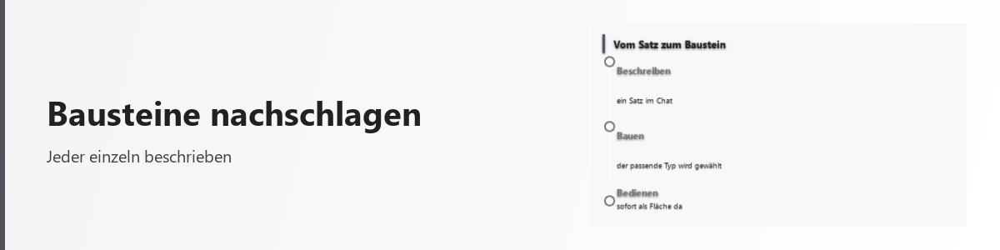

# Bausteine im Überblick
<!-- erzeugt: typenkatalog — nicht von Hand aendern -->

<picture>
  <source media="(prefers-color-scheme: dark)" srcset="../../bilder/kopf/bausteine.png">
  
</picture>

Die Plattform bringt **146 Bausteine** in **23 Familien** mit. Jeder davon lässt sich in einem Satz anfordern — die Konstruktion wählt den passenden aus.

| Familie | Bausteine | Wann diese Familie |
| --- | --- | --- |
| [system](system.md) | 23 | Wenn der Zustand des Rechners oder der Plattform beobachtet oder gesteuert wird. |
| [dataviz](dataviz.md) | 15 | Wenn Zahlen als Bild verständlicher sind als als Text — Verlauf, Anteil, Vergleich. |
| [data](data.md) | 10 | Wenn strukturierte Datenmengen bedienbar sein sollen — Baum, Raster, Board. |
| [feedback](feedback.md) | 9 | Wenn dem Nutzer etwas mitgeteilt wird, das er zur Kenntnis nimmt statt bedient. |
| [input](input.md) | 8 | Wenn der Nutzer etwas eingeben oder auswählen soll und der Wert danach weiterverarbeitet wird. |
| [content](content.md) | 8 | Wenn Text als Inhalt gesetzt wird: Überschrift, Absatz, Quelltextblock. |
| [media](media.md) | 7 | Wenn Bild, Ton, Video oder ein Dokument im Gen selbst dargestellt werden soll. |
| [display](display.md) | 7 | Wenn Vorhandenes gezeigt werden soll, ohne dass der Nutzer es ändert. |
| [container](container.md) | 6 | Wenn viel Inhalt abschnittsweise gezeigt wird — eingeklappt, gestuft oder geblättert. |
| [navigation](navigation.md) | 6 | Wenn zwischen Orten oder Seiten gewechselt wird, ohne Daten zu ändern. |
| [web](web.md) | 6 | Wenn der Inhalt aus dem Netz kommt und eine Webseite oder Suche bleiben soll. |
| [commerce](commerce.md) | 6 | Wenn Handelsangaben dargestellt werden — Preis, Produkt, Bewertung. |
| [interaction](interaction.md) | 5 | Wenn der Nutzer etwas auslösen soll — eine Aktion, keine Eingabe. |
| [config](config.md) | 5 | Wenn Einstellungen oder Profile der Plattform selbst bearbeitet werden. |
| [social](social.md) | 4 | Wenn Personen, Beiträge oder Reaktionen dargestellt werden. |
| [datetime](datetime.md) | 4 | Wenn ein Zeitpunkt oder Zeitraum gewählt oder angezeigt werden soll. |
| [layout](layout.md) | 3 | Wenn mehrere Inhalte in einem Gen nebeneinander oder gestaffelt Platz brauchen. |
| [diagram](diagram.md) | 3 | Wenn Beziehungen wichtiger sind als Werte — Ablauf, Netz, Hierarchie als Zeichnung. |
| [overlay](overlay.md) | 3 | Wenn etwas den laufenden Inhalt überlagert und danach wieder verschwindet. |
| [status](status.md) | 3 | Wenn der Stand eines Vorgangs sichtbar sein muss: läuft, fertig, fehlgeschlagen. |
| [compute](compute.md) | 2 | Wenn aus Eingaben ein Ergebnis gerechnet wird und die Rechenvorschrift zum Gen gehört. |
| [advanced](advanced.md) | 2 | Wenn kein deklarativer Typ passt — letzte Wahl, weil der Rumpf erzeugt statt deklariert wird. |
| [enterprise](enterprise.md) | 1 | Wenn ein Bestand verwaltet wird: anlegen, suchen, ändern, löschen (CRUD). |

---

Diese Seite wird aus dem Bausteinverzeichnis der Plattform **erzeugt** (`scripts/typenkatalog_erzeugen.py`). Sie kann deshalb nicht veralten, ohne dass es auffällt.
