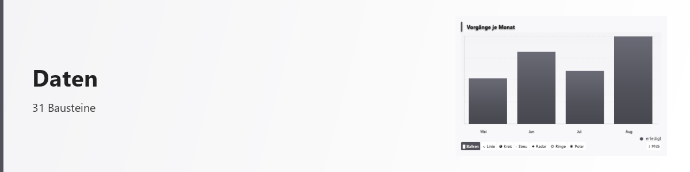
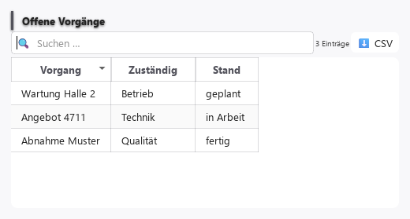
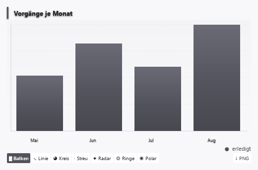

<!-- quelle: de/daten.md · stand: ee967e1de6e3 · fassung: maschinell -->

# Data

<picture>
  <source media="(prefers-color-scheme: dark)" srcset="../bilder/kopf/daten.png">
  
</picture>

!!! info "Machine translation"

    This page was translated automatically from the German original. Wording may be imprecise; the German version is authoritative.

**31 building blocks** for everything that has to do with databases: making them operable, using them as
Make the picture understandable, calculate from it, manage it and draw connections.

## The five types are

| Type | What for | Examples |
| --- | --- | --- |
| **Operable stocks** | structured quantities to work with | Table, tree, grid, task board |
| **Image instead of number column** | when a course, a proportion or a comparison is understood as an image more quickly | Line, bar, area, pie chart |
| **Calculation** | if a result is obtained from inputs and the calculation rule belongs to it | Computer, calculation module |
| **Manage** | when an inventory is created, searched, modified and deleted | Management Area |
| ** Draw relationships ** | if not numbers, but relationships are displayed | Flow, relationship, time diagram |

<picture>
  <source media="(prefers-color-scheme: dark)" srcset="../bilder/bausteine/tabelle.png">
  </picture>

*An operable stock: sorting via the column headers, filtering via the search field,
as a CSV — without having to request anything specifically.*

<picture>
  <source media="(prefers-color-scheme: dark)" srcset="../bilder/bausteine/diagramm.png">
  </picture>

*Same numbers as image. The display form can be toggled at the bottom without the
Area.*

## Where the data come from

A data building block is filled in three ways, and it's worth knowing the difference:

1. **Directly stored** — the values belong to the area itself. Good for the fixed.
2. **From another building block** — an inherited file fills the table, a selection in
of the table fills the chart next to it. This is the rule for multi-part surfaces.
3. **From a source** — file, interface, mailbox.

In the [module directory](../de/typen/index.md), each module contains what it accepts and
what he passes on. This results in which ones can be meaningfully linked.

## Where your data stays

What you put in an area remains on your computer. The platform does not provide a service
to which data would be transferred. Where an area reaches out — a search, a
Interface, a translation service — this is the task of this area and named.

## Calculation with stored rule

Computing modules execute a stored rule. They do this in a shielded
Limited language environment — no access to files, no reloading of any
Components. See [Security](../de/sicherheit.md) for details.

## What is honestly open here

- Charts are designed for manageable quantities. For very large stocks, this is
Drawing is noticeable because the values are fully processed.
- Drawing contexts creates fixed images — they can be viewed, but
do not reshape by dragging the nodes.
- There is no own query language across several modules. It is linked via
Transfer from one module to the next, not via a query.

---

All 31 modules with description are in the [module directory](../de/typen/index.md).